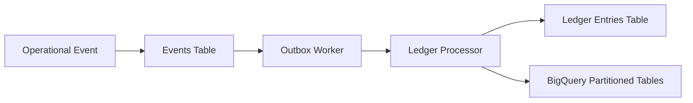

# Immutable Event-Driven Ledger on GCP
## Architecture Overview

---

## 1. Purpose

This project demonstrates the design of an immutable, event-driven financial ledger system built on Google Cloud Platform (GCP).

The goal is to provide:

- Strong financial integrity
- Full traceability of operational events
- No destructive updates
- No financial record rewriting
- Asynchronous processing
- Scalable, partitioned architecture

This architecture is designed to reflect enterprise-grade accounting discipline in cloud-native systems.

---

## 2. Architectural Principles

The system is built on the following principles:

### 🔒 Immutability

- Operational events are append-only
- Financial ledger entries are never updated or deleted
- Corrections are implemented via compensating events

### ⚡ Event-Driven Processing

- All business actions emit events
- Events are processed asynchronously
- At-least-once delivery with idempotency

### 📊 Double-Entry Discipline

- Every financial transaction generates balanced debit/credit entries
- Ledger integrity is enforced at processing time

### 🧩 Domain Separation

- Operational domain (business activity)
- Financial ledger domain (accounting truth)
- Processing domain (event handling logic)

---

## 3. High-Level Architecture

This shows:

- Operational event ingestion
- Event storage
- Outbox pattern
- Ledger processing
- Final ledger persistence

---

## 4. Core Components

### 4.1 Events Table

Stores immutable operational events.

Characteristics:

- Append-only
- Versioned
- Partitioned by `processed_at`
- Clustered by `tenant_id` (if multi-tenant)

### 4.2 Ledger Entries Table

Stores double-entry accounting records.

Characteristics:

- Immutable
- Balanced entries enforced
- Partitioned by accounting timestamp
- Suitable for financial reporting

### 4.3 Outbox Worker

Implements the Outbox Pattern:

- Polls unprocessed events
- Ensures idempotent processing
- Publishes to ledger processor
- Marks event as processed

**Purpose:** Guarantees reliable asynchronous processing.

### 4.4 Ledger Processor

Responsible for:

- Validating event structure
- Generating debit/credit entries
- Ensuring accounting balance
- Writing immutable ledger rows

---

## 5. Data Partitioning Strategy

BigQuery tables are:

- Partitioned by `processed_at`
- Clustered by `tenant_id`
- Optimized for:
  - Time-based reporting
  - Cost-efficient scanning
  - Audit trail reconstruction

This enables:

- Efficient historical queries
- Financial period reporting
- Regulatory auditing support

---

## 6. Idempotency Strategy

Each event includes:

- `event_id` (UUID)
- `event_version`
- Unique processing key

The ledger processor:

- Checks if event already processed
- Prevents duplicate financial entries
- Ensures safe retries

---

## 7. Failure Handling

The system supports:

- Retry mechanisms
- Dead-letter handling (conceptual)
- Non-destructive compensation entries

No event is deleted. Failures are traceable.

---

## 8. Why This Architecture Matters

Traditional CRUD-based systems allow:

- Record overwrites
- Silent corrections
- Hidden financial drift

This architecture enforces:

- Financial truth preservation
- Auditability
- Traceability
- Governance-ready data structures

It is suitable for:

- Payment systems
- Financial platforms
- Multi-tenant SaaS ledgers
- Compliance-heavy environments

---

## 9. Scalability Considerations

The architecture supports:

- Horizontal scaling via Cloud Run
- Partitioned BigQuery tables
- Asynchronous processing
- Multi-tenant extension

It can evolve into:

- Real-time streaming via Pub/Sub
- Reconciliation microservices
- Governance audit services