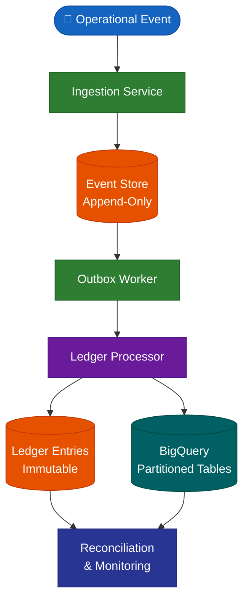

# Immutable Event-Driven Ledger on GCP
## Architecture Overview

---

## 1. Executive Summary

This project demonstrates the architecture of an immutable, event-driven financial ledger platform built on Google Cloud Platform (GCP).

The system is designed to model enterprise-grade financial integrity principles in a cloud-native environment. It emphasizes:

- Immutability
- Double-entry accounting discipline
- Domain separation
- Asynchronous event processing
- Deterministic reconciliation
- Multi-tenant scalability
- Governance-first architecture

The objective is to showcase how modern distributed systems can preserve financial truth without destructive updates while remaining horizontally scalable and operationally efficient.

---

## 2. Architectural Principles

The platform is built on the following non-negotiable principles:

### 2.1 Immutability First

- Operational events are append-only
- Financial ledger entries are never updated or deleted
- Corrections are implemented via compensating events
- Historical truth is preserved permanently

### 2.2 Event-Driven Processing

- All business actions emit events
- Events are processed asynchronously
- At-least-once delivery is supported with idempotency safeguards
- No direct mutation of financial state is allowed

### 2.3 Double-Entry Discipline

- Every financial transaction produces balanced debit and credit entries
- Ledger integrity is enforced at processing time
- No transaction can produce unbalanced financial state

### 2.4 Domain Separation

The system enforces strict logical separation between:

| Domain | Responsibility |
|---|---|
| Operational Domain | Business activity truth |
| Ledger Domain | Accounting truth |
| Processing Domain | Event transformation & validation |
| Governance Domain | Access control & policy enforcement |

Each domain evolves independently without compromising integrity.

### 2.5 Multi-Tenant Scalability

- Shared tables with strict tenant isolation
- Partitioning by time for performance optimisation
- Clustering by tenant identifier for cost efficiency
- Row-level security for governance enforcement

---

## 3. High-Level Architecture

The system follows an event-sourcing inspired architecture:

1. Operational Event Ingestion
2. Outbox Pattern Emission
3. Asynchronous Ledger Processing
4. Immutable Ledger Persistence
5. Reconciliation & Monitoring



All financial mutations occur exclusively through the Ledger Processor.

---

## 4. Core Components

### 4.1 Ingestion Service

- Accepts operational events
- Validates schema compliance
- Persists append-only event records
- Emits outbox messages

> This layer performs no financial mutation.

### 4.2 Event Store

- Append-only storage of operational events
- Schema-versioned payloads
- Immutable by design
- Serves as system source-of-truth for activity history

### 4.3 Outbox Worker

- Polls pending events
- Publishes them for ledger processing
- Ensures at-least-once delivery semantics
- Maintains idempotency guarantees

### 4.4 Ledger Processor

- Consumes operational events
- Applies double-entry logic
- Generates immutable ledger entries
- Enforces financial balancing rules
- Rejects invalid transactions

> No ledger entry is ever updated after insertion.

### 4.5 Ledger Storage (BigQuery)

- Partitioned by `processed_at`
- Clustered by `tenant_id`
- Immutable append-only structure
- Optimised for analytical and reconciliation workloads

### 4.6 Reconciliation & Monitoring

- Compares operational events vs ledger state
- Detects divergence
- Surfaces anomalies
- Ensures capital integrity

> Reconciliation is automated and continuous.

---

## 5. Data Model Strategy

### 5.1 Event Envelope

All events follow a canonical envelope:

| Field | Type | Description |
|---|---|---|
| `event_id` | UUID | Unique event identifier |
| `event_type` | String | Business event classification |
| `tenant_id` | String | Tenant isolation key |
| `occurred_at` | Timestamp | When the business action happened |
| `processed_at` | Timestamp | When the event was processed |
| `schema_version` | Integer | Payload schema version |
| `payload` | JSON | Event-specific data |

Event versioning is supported from day one.

### 5.2 Ledger Model

Ledger entries contain:

| Field | Type | Description |
|---|---|---|
| `ledger_event_id` | UUID | Unique ledger entry identifier |
| `original_event_id` | UUID | Reference to source event |
| `tenant_id` | String | Tenant isolation key |
| `account_id` | String | Chart of accounts reference |
| `debit_amount` | Decimal | Debit side of entry |
| `credit_amount` | Decimal | Credit side of entry |
| `currency` | String | ISO 4217 currency code |
| `processed_at` | Timestamp | Immutable processing timestamp |

Each transaction must satisfy:

```
SUM(debit) = SUM(credit)
```

---

## 6. Partitioning & Performance Strategy

To optimise cost and performance:

- Tables are partitioned by `processed_at`
- Tables are clustered by `tenant_id`
- Queries are time-bounded whenever possible
- Analytical workloads are isolated from ingestion workloads

This approach minimises scanned bytes and enforces predictable performance.

---

## 7. Governance & Security

- Row-Level Security (RLS) enforced per tenant
- Service-to-service authentication via identity tokens
- No direct write access to ledger tables
- All mutations pass through controlled backend services
- Immutable logs for audit compliance

> The system assumes a zero-trust internal architecture.

---

## 8. Failure Handling & Idempotency

The system tolerates distributed failures through:

- At-least-once delivery semantics
- Idempotent ledger processing
- Retry-safe operations
- Explicit failure states
- Compensating events instead of destructive edits

> Duplicate processing does not produce duplicate financial impact.

---

## 9. Design Trade-Offs

| Decision | Rationale |
|---|---|
| Append-only ledger | Guarantees financial truth preservation |
| Asynchronous processing | Enables scalability & resilience |
| Shared multi-tenant tables | Cost-efficient SaaS scalability |
| Compensating events | Preserves historical auditability |
| No deletes | Prevents historical corruption |
