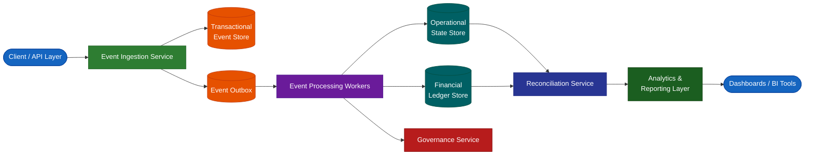

# Enterprise Event-Driven Financial & Operational Data Platform

## Overview

This repository documents the architecture of an enterprise-grade, event-driven data platform designed to support operational workflows, financial integrity, and scalable analytics in a cloud-native environment.

The platform is built with the following objectives:

- Strong data integrity guarantees
- Immutable event storage
- Clear separation of operational and financial domains
- Asynchronous processing
- Multi-tenant scalability
- Observability and reconciliation across domains
- Production-grade cloud deployment patterns

The system is not a CRUD-based application. It is designed around event immutability and auditability from day one.

---

## Architectural Principles

### 1. Immutability

- Operational events are append-only
- Financial ledger entries are never updated or deleted
- Corrections are implemented via compensating events
- Historical truth is preserved at all times

### 2. Event-Driven Design

- All state transitions originate from domain events
- Processing is asynchronous where appropriate
- At-least-once delivery with idempotency safeguards
- Event versioning supported from initial design

### 3. Domain Separation

The system enforces strict separation between:

- **Operational Domain** — Business activities (inventory, orders, workflows)
- **Financial Domain** — Double-entry accounting ledger
- **Governance Domain** — Approvals, controls, policy enforcement
- **Reconciliation Domain** — Cross-domain validation & drift detection
- **Analytics Domain** — Aggregations, projections, reporting models

Each domain is independently evolvable.

### 4. Multi-Tenant Strategy

- Shared tables with `tenant_id` isolation
- Row-Level Security (RLS) for data visibility enforcement
- Partitioning by `processed_at` for time-based access patterns
- Clustering by `tenant_id` for query efficiency and cost optimisation

### 5. Auditability

- Full event lineage traceability
- No destructive mutations
- Ledger integrity enforced at processing time
- Automated reconciliation jobs

---

## High-Level Architecture

### Logical Flow

1. Client / API emits a domain event
2. Event is stored atomically in the transactional store
3. Event is published to the processing pipeline
4. Domain-specific processors handle:
   - Operational state updates
   - Financial ledger postings
   - Governance validations
5. Reconciliation jobs verify cross-domain consistency
6. Analytics projections are updated

---

## System Architecture Diagram



---

## Core Components

### Event Ingestion Service

- Validates input
- Generates immutable `event_id`
- Ensures idempotency
- Writes to transactional store
- Publishes to outbox for asynchronous processing

### Event Processing Workers

- Consume events from queue
- Enforce business rules
- Write operational state projections
- Emit financial ledger entries
- Maintain retry safety

### Financial Ledger

- Double-entry accounting model
- Append-only journal
- Separate gain/loss accounts
- Foreign currency revaluation supported
- No update or delete operations

### Reconciliation Engine

- Compares operational vs financial states
- Detects divergence
- Emits reconciliation events
- Supports automated or governance-based resolution

### Governance Layer

- Policy enforcement
- Threshold-based approvals
- Risk signal emission
- Audit visibility

### Analytics Layer

- Derived, query-optimised views
- Time-partitioned
- Tenant-clustered
- Designed for BI consumption (Looker / Power BI compatible)

---

## Data Modelling Strategy

### Event Schema

```json
{
  "event_id": "uuid",
  "event_type": "string",
  "tenant_id": "uuid",
  "payload": {},
  "event_version": 1,
  "processed_at": "timestamp",
  "created_at": "timestamp"
}
```

### Financial Ledger Model

| Field | Description |
|---|---|
| `ledger_event_id` | Unique ledger entry identifier (UUID) |
| `original_event_id` | Reference to the source operational event |
| `tenant_id` | Tenant isolation key |
| `debit_account` | Account debited in the transaction |
| `credit_account` | Account credited in the transaction |
| `amount` | Transaction value |
| `currency` | ISO 4217 currency code |
| `created_at` | Immutable creation timestamp |

> No destructive mutations are allowed at any point.

---

## Scalability Considerations

- Horizontal scaling via stateless Cloud Run services
- Asynchronous processing to prevent synchronous bottlenecks
- BigQuery partitioning for time-based query optimisation
- Clustering for tenant-based filtering efficiency
- Polling worker pattern for reliable event completion
- Idempotency guards for safe retries

---

## Reliability & Integrity Controls

- At-least-once event processing
- Idempotent handlers
- Immutable ledger enforcement
- Cross-domain reconciliation checks
- Governance escalation for anomaly conditions

---

## Deployment Model

| Component | Technology |
|---|---|
| Microservices | Containerised (Docker) |
| Compute | Cloud Run |
| Warehouse | BigQuery (managed) |
| Transactional Store | Firestore |
| Event Queue | Pub/Sub |
| Permissions | IAM-controlled service accounts |

---

## Observability

- Processing health metrics
- Failure logs
- Reconciliation drift alerts
- Audit trail tracking
- KPI dashboards

---

## Why This Architecture

This architecture prioritises:

- **Data correctness** over convenience
- **Auditability** over mutation
- **Scalability** over tight coupling
- **Domain separation** over monolithic design
- **Cloud-native elasticity** from the ground up

It is designed to support long-term growth, regulatory compliance, and operational reliability in production-grade environments.

---

## Status

| Component | Status |
|---|---|
| Event ingestion | ✅ Implemented |
| Inventory movement foundation | ✅ Implemented |
| Financial ledger backbone | 🔄 In progress |
| Reconciliation microservice | 📐 Designed |
| Governance escalation framework | 📐 Designed |
| Analytics projections | ✅ Implemented (initial layer) |
